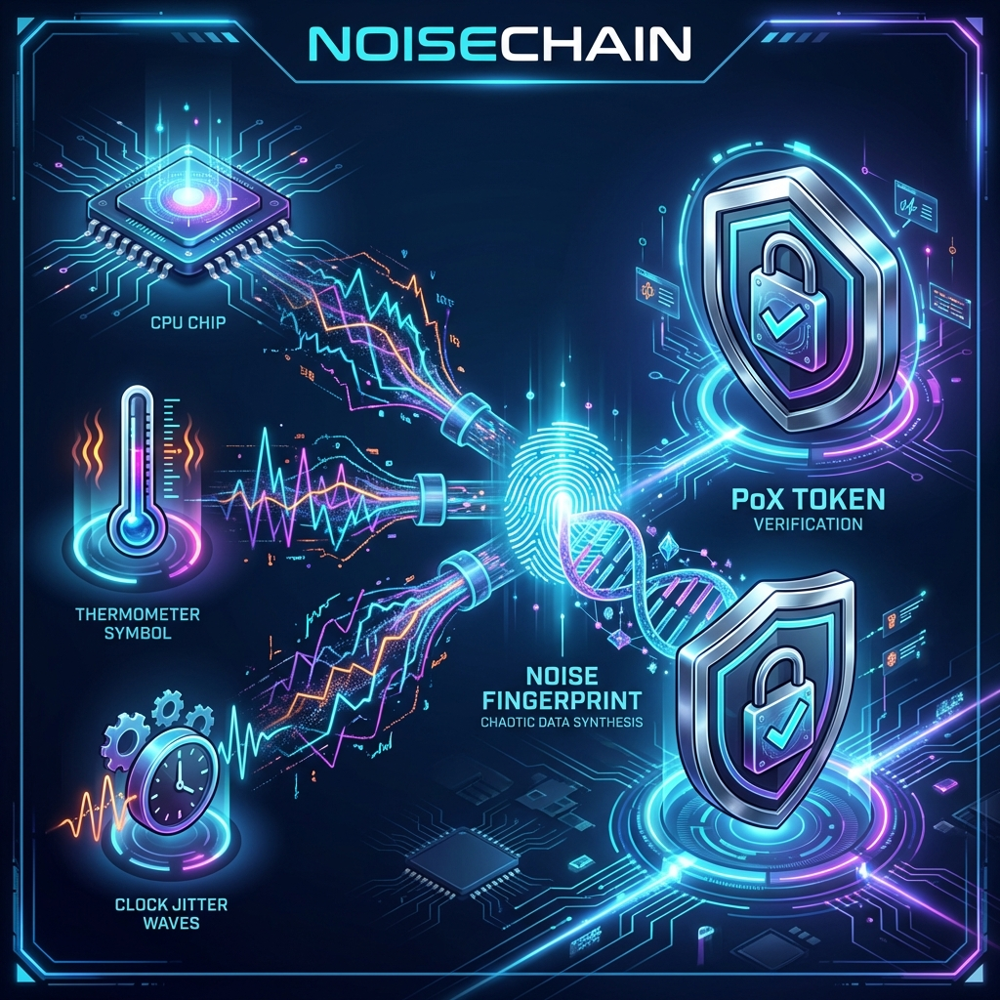

# NoiseChain MVP

**Physical Trust Verification Network based on Proof-of-Experience (PoX)**

[](https://www.python.org/downloads/)
[](#tests)
[](https://opensource.org/licenses/MIT)



## Overview

NoiseChain is a **Physical Trust Verification Network** that transforms the temporal correlation structure of physical environmental noise (temperature, vibration, EMI, power fluctuations) into a cryptographic signature. It proves that **"a specific device actually experienced a specific environment at a specific time."**

[🇰🇷 Korean Version (한국어)](README_ko.md)

## Quick Start

```bash
# Install dependencies
pip install -r requirements.txt

# Install in development mode
pip install -e .

# Run tests
pytest

# Run demo
python -m noisechain.demo demo
```

## Usage

### Python API

```python
from noisechain import NoiseChainPipeline

# Create pipeline
with NoiseChainPipeline() as pipeline:
    # Collect sensor data -> Generate Token -> Sign -> Store -> Verify
    result = pipeline.generate_and_store()
    
    print(f"Success: {result.success}")
    print(f"Token Hash: {result.token.compute_hash().hex()[:32]}...")
    print(f"Valid: {result.verification.is_valid}")
```

### CLI Demo

```bash
# Run full demo
python -m noisechain.demo demo

# Generate token
python -m noisechain.demo generate --samples 256

# Run benchmark
python -m noisechain.demo benchmark --iterations 10
```

## Architecture

```
┌─────────────┐    ┌─────────────┐    ┌─────────────┐
│  SensorHub  │───▶│TokenBuilder │───▶│TokenSigner  │
│ (4 sensors) │    │ (features)  │    │ (Ed25519)   │
└─────────────┘    └─────────────┘    └─────────────┘
                                              │
                                              ▼
┌─────────────┐    ┌─────────────┐    ┌─────────────┐
│Verification │◀───│ Repository  │◀───│  PoXToken   │
│   Engine    │    │  (SQLite)   │    │  (199 B)    │
└─────────────┘    └─────────────┘    └─────────────┘
```

## Project Structure

```
NoiseChain/
├── src/noisechain/
│   ├── models/          # Data Models (Sample, TimeSeries)
│   ├── sensors/         # Virtual Sensor Drivers (4 types)
│   ├── time/            # NTP Time Synchronization
│   ├── pipeline/        # Feature Extraction & Correlation Signature
│   ├── token/           # PoXToken Schema (199 bytes)
│   ├── crypto/          # Ed25519 Key Management & Signing
│   ├── storage/         # SQLite Token Repository
│   ├── verification/    # 4-Stage Verification Engine
│   ├── engine.py        # E2E Pipeline
│   └── demo.py          # CLI Demo
├── tests/               # 258 Test Cases
├── docs/                # Design Documents
├── pyproject.toml       # Project Configuration
└── requirements.txt     # Dependencies
```

## Key Concepts

| Concept | Description |
|---------|-------------|
| **PoX Token** | Proof-of-Experience Token (199 bytes) |
| **Noise Fingerprint** | Non-replicable noise fingerprint (99 bytes) |
| **Correlation Signature** | Multi-sensor correlation structure signature (SHA3-256) |
| **Risk Score** | 0-100% Risk-based judgment |

## Verification Pipeline

```
1. Schema Validation    ─▶ Verify field size and ranges
2. Signature Verify     ─▶ Verify Ed25519 signature
3. Timestamp Check      ─▶ Check for future/expired timestamps
4. Risk Score Assess    ─▶ Compare against threshold
```

## Tests

```bash
# Run all tests
pytest

# Coverage report
pytest --cov=noisechain --cov-report=html
```

| Module | Test Cases |
|--------|------------|
| models | 28 |
| sensors | 42 |
| time | 25 |
| features | 29 |
| correlation | 21 |
| token | 24 |
| crypto | 24 |
| storage | 21 |
| verification | 25 |
| pipeline | 18 |
| **Total** | **258** |

## Performance

- **Token Generation**: ~10ms (256 samples)
- **Token Size**: 199 bytes (including signature)
- **Throughput**: ~100 tokens/sec

## Dependencies

- Python 3.11+
- numpy
- scipy
- pynacl (Ed25519)
- ntplib

## License

MIT License

## Author

**Jung Wook Yang**  
📧 <sadpig70@gmail.com>  
🔗 [GitHub](https://github.com/sadpig70/NoiseChain)
