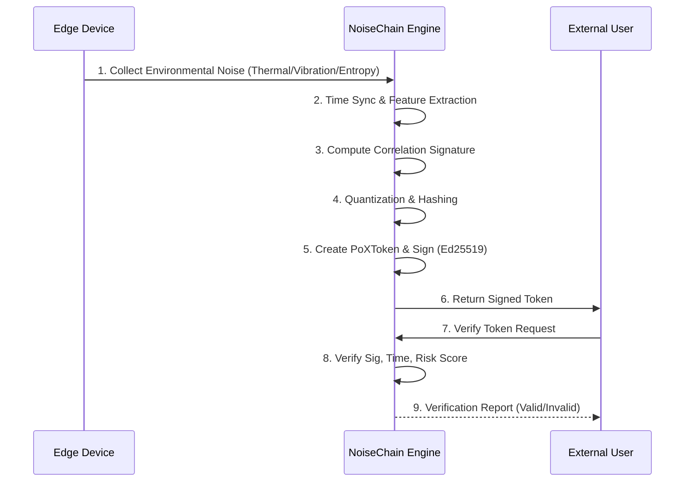

# NoiseChain Specification

**Version**: 1.0  
**Date**: 2026-01-13  
**Status**: Approved  
**Project**: NoiseChain

[🇰🇷 Korean Version (한국어)](NoiseChain_Specification_ko.md)

---

## 1. Overview

**NoiseChain** is a **Physical Trust Verification Network** that transforms the chaotic temporal correlation structure of physical environmental noise (thermal, vibration, EMI, power fluctuations) into a quantum-proof cryptographic signature. It proves that **"a specific device actually experienced a specific environment at a specific time."**

### 1.1 Core Philosophy

| Principle | Description |
|-----------|-------------|
| **Noise is Resource** | Noise is not an error to be removed, but a non-replicable security resource. |
| **Physical Zero Trust** | Only physical experience proves authenticity, not just digital keys. |
| **Time is the Key** | Identical noise patterns never repeat in spacetime. |

### 1.2 One-Liner

> *"A chain that issues receipts of physical experience (time & environment), not just digital signatures."*

---

## 2. Purpose & Vision

### 2.1 Core Objectives

1. **Physical Authenticity**: Proving data **actually happened in reality**, not just "tamper-evident".
2. **Solving Oracle Problem**: Bridging the gap between physical reality and blockchain input using entropy.
3. **Regulatory Infrastructure**: Compliance for EU Battery Pass, FDA DSCSA (Physical tracking mandates).
4. **Proof Recipes**: Assetizing industry-specific noise profiles to build a network moat.

### 2.2 Non-Goals

- Not building a general-purpose L1 blockchain.
- Not guaranteeing 100% unforgeability, but **maximizing attack cost** and using **Risk Scores**.
- Not storing raw sensor data at scale (storing only sketches/features).

---

## 3. Target Use Cases

| Industry | Use Case | Benefit |
|----------|----------|---------|
| **Supply Chain** | Semiconductor/Defense parts tracking | Immediate detection of counterfeit parts |
| **Cold Chain** | Vaccine/Bio-material transport | Proof of continuous temperature conditions |
| **Clinical Trials** | Lab data authenticity | Preventing data fabrication |
| **ESG** | Real-time carbon/energy certification | Preventing Greenwashing |
| **Pharma** | FDA DSCSA compliance | Blocking $200B+ annual counterfeit drugs |

---

## 4. Key Concepts

### 4.1 PoX (Proof-of-Experience)

Proving that "this device **actually** experienced that environment **during that time window**."  
Consists of **multi-sensor correlation structures**, not single sensor values.

### 4.2 Noise Fingerprint

Environmental noise forms unique patterns across space and time.  
Identical patterns are physically impossible to reproduce → Used as an unforgeable fingerprint.

### 4.3 Time-Noise Receipt

A proof token generated by hashing noise collected in a specific time window.  
Cryptographically proves "When, Where, and What environment."

### 4.4 Correlation Signature

A **sketch (compressed feature)** representing the correlation structure of simultaneous impacts on Temperature, Vibration, Power, EMI, and Clock Jitter.

### 4.5 Profile (Proof Recipe)

A set of policies defining "which sensors/features/thresholds" are suitable for specific industries/regulations.  
More profiles create a stronger network effect.

---

## 5. System Architecture

### 5.1 Layered Structure (MVP)

```
┌─────────────────────────────────────────────────────────────┐
│                    [Layer 3] Verification Gateway           │
│  • Fuzzy Verification                                       │
│  • Proof-of-Existence API (RESTful)                         │
│  • Regulatory Reporting (EU Battery Pass, FDA DSCSA)        │
└─────────────────────────────────────────────────────────────┘
                              ▲
                              │
┌─────────────────────────────────────────────────────────────┐
│                    [Layer 2] Engine Core                    │
│  • Correlation Signature Generation                         │
│  • Token Minting (PoXToken)                                 │
│  • Key Management (Ed25519)                                 │
└─────────────────────────────────────────────────────────────┘
                              ▲
                              │
┌─────────────────────────────────────────────────────────────┐
│                    [Layer 1] Edge Sensing                   │
│  • Noise Mining (Multi-sensor or Virtual Simulation)        │
│  • Time-Sync Quantization (NTP)                             │
│  • Feature Extraction (Stats/Freq/Time)                     │
└─────────────────────────────────────────────────────────────┘
```

### 5.2 Components

| Component | Role |
|-----------|------|
| **EdgeNode** | Sensor collection, Feature extraction, PoXToken generation |
| **Verifier** | Validation (Schema, Sig, Time, Risk), Risk Score calculation |
| **Repository** | Append-only storage (SQLite), Indexing |
| **Orchestrator** | E2E Pipeline management |

---

## 6. Functional Requirements

### 6.1 PoXToken Minting (EdgeNode)

1. Synchronous acquisition of multi-sensor data (or **Virtual Noise Generation**).
2. NTP-based Time Synchronization.
3. Preprocessing/Normalization.
4. Feature Extraction (Spectral/Temporal/Entropy/Jitter).
5. Multi-lag Correlation Structure generation.
6. Cryptographic Signing (Ed25519).

> **Simulation Mode**: Can substitute real sensors with CPU Temp, OS Entropy, and Synthetic Noise.

### 6.2 Verification (Verifier)

1. Schema/Version/Profile validation.
2. Time Window, Replay check.
3. Signature Integrity check.
4. Profile-based **Risk Score** calculation.
5. Result (Pass/Fail/Warning) + Receipt generation.

### 6.3 Append-Only Ledger

- **Required**: Append-only, Lookup by Time/ID, Audit trails.

---

## 7. Data Flow



---

## 8. Tech Stack (MVP)

| Area | Technology | Description |
|------|------------|-------------|
| **Language** | Python 3.11+ | Rapid prototyping, Ecosystem |
| **Core Libs** | numpy, scipy | Signal processing, Stats |
| **Crypto** | PyNaCl (Ed25519) | High-speed signing, DJB Curve25519 |
| **Storage** | SQLite | Serverless embedded DB, WAL mode |
| **Time Sync** | ntplib | NTP offset correction |
| **Testing** | pytest | Unit/Integration/E2E automation |
| **Future** | Rust (PQC) | For high-performance/security in production |

---

## 9. Security Model

### 9.1 Threat Analysis

| Threat | Mitigation Mechanism |
|--------|----------------------|
| Replay Attack | Timestamp window checks |
| Sensor Spoofing | Multi-sensor correlation structure verification |
| Time Manipulation | NTP Sync + Drift detection |
| Key Compromise | Key Rotation |
| Data Tampering | Ed25519 Signatures |

### 9.2 Decision Model

- **Accept**: All checks passed, Low Risk Score.
- **Review**: Borderline scores, requires manual audit.
- **Reject**: Invalid signature, Future timestamp, High Risk Score.

---

## 10. Differentiation

| Feature | Traditional Solution | NoiseChain |
|---------|----------------------|------------|
| **Basis** | Digital Keys | Physical Noise Fingerprint |
| **Forgeability** | Vulnerable if key stolen | Physically non-replicable |
| **Oracle Problem** | Unsolved | Solved by physical entropy |
| **Post-Quantum** | Migration needed | Inherently resistant (Entropy) |
| **Cost** | High infrastructure | Uses existing sensors |

---

## 11. Roadmap

> **Current Status**: MVP (Simulation) Completed.

### Phase 1: MVP - Simulation (Completed)

- **Virtual Sensors**: CPU Temp, OS Entropy, Synthetic Noise.
- EdgeNode PoXToken v1 Minting.
- Verifier Engine & Risk Scoring.
- SQLite Storage.
- CLI Demo & E2E Pipeline.
- **Outcome**: 258 Tests Passed, Working Demo.

### Phase 2: Pilot - Hardware Integration (Next)

- Hardware Sensor integration (MEMS, Thermistors).
- PTP Precision Time Sync.
- Distributed Validator Nodes.
- Regulatory Modules (EU Batt/FDA).

### Phase 3: Commercialization

- P2P Network.
- SaaS / Dashboard.
- Global Partnerships.

---

## 12. Business Model

| Model | Pricing | Target |
|-------|---------|--------|
| Node SaaS | $500/node/mo | Manufacturers, Logistics |
| API | Tiered / call | Retailers, Consumers |
| Certification | Per unit | High-value (Pharma, Chips) |
| Enterprise | Annual License | Large Corps (Regulation) |

---

## 13. Regulations & Standards

- **EU**: Battery Pass (2027), Ecodesign.
- **US**: FDA DSCSA, NIST PQC.
- **Global**: GS1 Digital Link, ISO 15459 (UID).

---

## 14. Simulation Environment (MVP)

### Virtual Sensor Mapping

| Real Sensor | Simulation Mapping |
|-------------|--------------------|
| Temperature | CPU/GPU Temperature (or synthetic sine wave) |
| Vibration | White noise or synthetic patterns |
| EMI | CPU Clock Jitter, Memory timing |
| Power | Random walk / Gaussian noise |

### Validated Items

- ✅ Feature Extraction (Stats/Freq/Time)
- ✅ Correlation Signature Generation
- ✅ PoXToken Minting/Verification Pipeline
- ✅ Risk Score Assessment

---

## 15. Open Questions (Status)

1. **PoXToken v1 Schema** → **RESOLVED**: 199-byte fixed binary (Fingerprint + Metadata + Sig).
2. **Correlation Algo** → **RESOLVED**: Cross-correlation + MinMax + SHA3-256.
3. **Time Sync** → **RESOLVED**: NTP-based offset correction (1s tolerance).
4. **Governance** → To be defined in Phase 3.

---

## Appendix: Implemented Data Structures

### PoXToken (v0.1.0)

```json
{
  "version": 1,
  "node_id": "04a1... (16 bytes)",
  "timestamp_ns": 1705123456789000000,
  "fingerprint": {
    "feature_vector": "base64...",
    "correlation_hash": "sha3-256...",
    "sensor_count": 4,
    "sample_count": 256
  },
  "risk_score": 15.5,
  "signature": "ed25519_sig..."
}
```

### Verification Report

```json
{
  "token_hash": "a1b2...",
  "is_valid": true,
  "timestamp": "2026-01-13T19:30:00",
  "steps": [
    {
      "name": "schema",
      "status": "PASSED",
      "message": "Valid PoXToken v1"
    },
    {
      "name": "signature",
      "status": "PASSED",
      "message": "Ed25519 signature verified"
    },
    {
      "name": "timestamp",
      "status": "PASSED",
      "message": "Age: 0.1s"
    },
    {
      "name": "risk_score",
      "status": "PASSED",
      "message": "Score 15.5 (Threshold: 80.0)"
    }
  ]
}
```

---

*— End of Document —*
