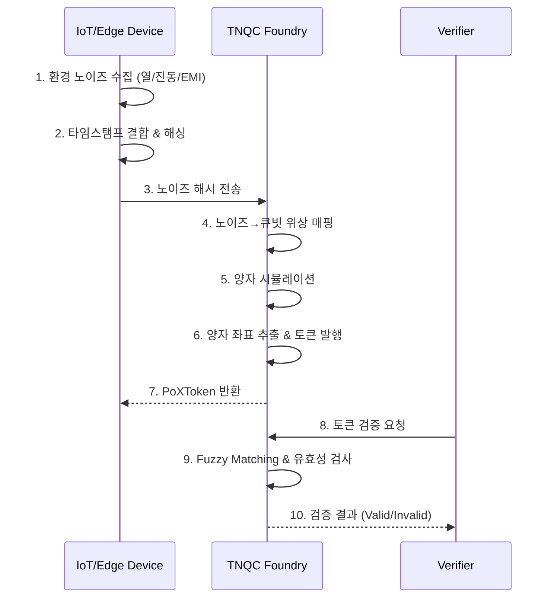

# NoiseChain 기술 명세서

**문서 버전**: 1.0  
**작성일**: 2026-01-13  
**상태**: 승인됨 (Approved)  
**프로젝트**: NoiseChain

---

## 1. 개요 (Overview)

**NoiseChain**은 물리적 환경 노이즈(온도, 진동, EMI, 전력 변동)의 시간적 상관 구조를 양자 기반 서명으로 변환하여, **"특정 장비/제품이 특정 시간·환경을 실제로 경험했다"**를 증명하는 **물리적 신뢰 검증 네트워크(Physical Trust Verification Network)**입니다.

### 1.1 핵심 철학

| 원칙 | 설명 |
|------|------|
| **Noise is Resource** | 노이즈는 제거할 오류가 아닌, 복제 불가능한 보안 자원 |
| **Physical Zero Trust** | 디지털 서명이 아닌 물리적 경험만이 원본성을 증명 |
| **Time is the Key** | 동일한 노이즈 패턴은 절대 반복되지 않음 |

### 1.2 한 줄 정의

> *"디지털 서명이 아닌, 물리적 경험(시간·환경)의 영수증을 발급하는 체인."*

---

## 2. 목적 및 비전

### 2.1 핵심 목적

1. **물리적 진위 증명**: 데이터가 "변조되지 않았다"가 아니라, **현실에서 실제로 발생했음**을 증명
2. **Oracle Problem 해결**: 블록체인의 입력 데이터 진위 문제를 물리적 노이즈로 극복
3. **규제 대응 인프라**: EU Battery Pass, FDA DSCSA 등 물리적 추적 의무화 대응
4. **산업별 증명 레시피**: 업종별 노이즈 프로파일을 자산화하여 네트워크 해자(Moat) 구축

### 2.2 비목표 (Non-Goals)

- 범용 L1 블록체인 구축이 아님
- 100% 위조 불가능 보장이 아닌, **공격 비용 극대화** 및 **위험 점수(Risk Score)** 운영
- 원본 센서 데이터 대규모 저장 (특징/스케치 기반 저장 원칙)

---

## 3. 대상 사용 사례

| 산업 | 사용 사례 | 효과 |
|------|----------|------|
| **공급망** | 반도체/항공/국방 부품 이력 추적 | 위조 부품 즉시 탐지 |
| **콜드체인** | 백신/바이오 소재 운송 조건 검증 | 온도 이탈 증명 |
| **임상시험** | 실험실 데이터 현장 발생 증거화 | 데이터 조작 방지 |
| **ESG** | 탄소배출/에너지 사용 실시간 인증 | 그린워싱 방지 |
| **제약** | FDA DSCSA 준수 | 연간 $200B+ 위조약 피해 차단 |

---

## 4. 핵심 개념

### 4.1 PoX (Proof-of-Experience)

"이 장비가 **그 시간창 동안** 그 환경을 **실제로** 겪었다"를 증명하는 개념.  
단일 센서 값이 아닌 **다중 센서의 상관 구조**로 구성.

### 4.2 노이즈 지문 (Noise Fingerprint)

환경 노이즈는 시간과 공간에 따라 고유한 패턴 형성.  
동일한 패턴은 물리적으로 재현 불가능 → 위조 불가능한 지문으로 활용.

### 4.3 시간-노이즈 영수증 (Time-Noise Receipt)

특정 시간창에서 수집된 노이즈를 해시화하여 생성되는 증명 토큰.  
"언제, 어디서, 어떤 환경을 경험했는가"를 암호학적으로 증명.

### 4.4 상관 서명 (Correlation Signature)

온도/진동/전력/EMI/클럭 지터가 동시에 받는 환경 영향의 상관 구조를  
**스케치(압축 특징)**로 만들어 서명하여 증거화.

### 4.5 Profile (증명 레시피)

업종/규제/현장 조건마다 "어떤 센서/특징/임계값"이 적합한지 정의한 정책 묶음.  
프로파일이 많아질수록 방어가 강해지고 전환 비용 상승 (네트워크 효과).

---

## 5. 시스템 아키텍처

### 5.1 3계층 구조

```
┌─────────────────────────────────────────────────────────────┐
│                    [Layer 3] Verification Gateway           │
│  • Fuzzy Verification (유사도 검증)                          │
│  • Proof-of-Existence API (RESTful/gRPC)                    │
│  • 규제 보고 자동화 (EU Battery Pass, FDA DSCSA)             │
└─────────────────────────────────────────────────────────────┘
                              ▲
                              │
┌─────────────────────────────────────────────────────────────┐
│                    [Layer 2] TNQC Foundry Core              │
│  • Noise-to-Quantum Mapping (노이즈→큐빗 위상 매핑)          │
│  • Entropy Challenge (QRNG + 노이즈 혼합)                   │
│  • Token Minting (PoXToken 발행)                            │
└─────────────────────────────────────────────────────────────┘
                              ▲
                              │
┌─────────────────────────────────────────────────────────────┐
│                    [Layer 1] Edge Sensing                   │
│  • Noise Mining (다중 센서 수집 또는 가상 노이즈 생성)         │
│  • Time-Sync Quantization (나노초 동기화)                    │
│  • Feature Extraction (특징 추출)                           │
└─────────────────────────────────────────────────────────────┘
```

### 5.2 구성 요소

| 컴포넌트 | 역할 |
|----------|------|
| **EdgeNode** | 센서 수집 (또는 가상 노이즈), 특징 추출, PoXToken 생성 |
| **Gateway** | 집계, 캐시, 공동서명 (선택) |
| **Verifier** | 검증 API, 위험 점수 산출 |
| **Ledger** | Append-only 저장, 인덱스 |
| **Profile Registry** | 증명 레시피/정책 저장소 |

---

## 6. 주요 기능 요구사항

### 6.1 PoXToken 발급 (EdgeNode)

1. 다중 센서 동시 수집 또는 **가상 노이즈 생성** (시뮬레이션 모드)
2. NTP 기반 시간 동기화
3. 전처리/정규화/결측 처리
4. 특징 추출 (스펙트럼/시간/엔트로피/지터)
5. 다중 라그 상관 구조 생성
6. 검증자 Nonce 포함 (anti-replay)
7. 해시체인 구성 (연속 토큰 변조 탐지)
8. 디바이스 키로 서명

> **시뮬레이션 모드**: 실제 하드웨어 센서 없이 CPU 온도, OS 엔트로피, 합성 노이즈로 대체 가능

### 6.2 검증 (Verifier)

1. 스키마/버전/프로파일 적합성 검사
2. 시간창/Nonce/리플레이/중복 제출 검사
3. 서명/해시체인 무결성 검사
4. 프로파일 기반 위험 점수 계산
5. 결과 (accept/review/reject) + 영수증 발급

### 6.3 Append-Only Ledger

- **필수**: 변경 불가(append-only), 시간/장비/제품 키 조회, 감사 증빙 내보내기
- **선택**: Merkle Root 생성, 퍼블릭 체인 앵커링

---

## 7. 데이터 흐름



---

## 8. 기술 스택

| 영역 | 기술 | 선택 이유 |
|------|------|-----------|
| **Core Language** | Rust | 성능, 메모리 안전성, 임베디드 호환 |
| **Async Runtime** | Tokio | 고성능 비동기 I/O |
| **Local DB** | SQLite + rusqlite | 경량, 임베디드, 신뢰성 |
| **Distributed Store** | TimescaleDB | 시계열 로그 저장 |
| **HTTP Server** | Axum | Rust 생태계 통합 |
| **Serialization** | Serde + CBOR | 바이너리 효율 |
| **Crypto** | ring / ed25519-dalek | 고속, 검증된 보안 |
| **PQC** | Kyber/Dilithium | 양자 내성 암호 (미래 대비) |
| **P2P** | libp2p-rust | 표준화된 P2P 스택 |
| **Quantum** | Prophet Simulator + NISO | 자체 개발 양자 시뮬레이터 |

---

## 9. 보안 모델

### 9.1 위협 분석

| 위협 | 방어 메커니즘 |
|------|--------------|
| 리플레이 공격 | Nonce 기반 anti-replay |
| 센서 스푸핑 | 다중 센서 상관 구조 검증 |
| 시간 조작 | GPS PPS + 드리프트 탐지 |
| 내부자 공격 | TPM/HSM 키 보호 + 로테이션 |
| 데이터 변조 | 해시체인 + 서명 |

### 9.2 판정 모델

- **Accept**: 모든 검증 통과, 위험 점수 낮음
- **Review**: 일부 이상 징후, 수동 검토 필요
- **Reject**: 명확한 위조/변조 탐지

---

## 10. 차별화 요소

| 비교 항목 | 기존 솔루션 | NoiseChain |
|-----------|-------------|------------|
| 인증 기반 | 디지털 서명 | 물리적 노이즈 지문 |
| 위조 가능성 | 키 탈취 시 위조 가능 | 물리적 복제 불가능 |
| Oracle Problem | 해결 불가 | 물리 환경으로 해결 |
| 양자 내성 | 별도 마이그레이션 필요 | 노이즈 기반 내재적 보유 |
| 비용 구조 | 높은 인프라 비용 | 기존 센서 활용 |

---

## 11. 개발 로드맵

> **개발 환경**: 독립 연구 환경으로 실제 하드웨어 센서 없이 **시뮬레이션 기반** 개발 진행

### Phase 1: MVP - 시뮬레이션 (0-3개월)

- **가상 센서 드라이버**: CPU 온도, OS 엔트로피(/dev/urandom), 합성 노이즈
- EdgeNode PoXToken v1 발급 (시뮬레이션 노이즈 기반)
- Verifier 검증 + Receipt 발급
- Append-only 저장 + 기본 조회
- Profile v1 1개 (시뮬레이션 검증용)
- **KPI**: 알고리즘 검증, 리플레이 공격 탐지 시연, 위조 탐지 데모

### Phase 2: 파일럿 - 하드웨어 연동 (3-9개월)

- 파트너사 하드웨어 센서 연동 (온도, 진동, EMI, 전력)
- PTP 정밀 시간 동기화
- FFT 기반 주파수 특징 추출
- 분산 저장소 + 합의
- EU Battery Pass / FDA DSCSA 모듈

### Phase 3: 상용화 (9-18개월)

- P2P 네트워크 완전 구현
- 웹훅 / 대시보드 / 분석 도구
- SaaS 구독 모델 출시
- 글로벌 파트너십 확대

---

## 12. 비즈니스 모델

| 모델 | 가격 | 대상 |
|------|------|------|
| 노드 SaaS | $500/노드/월 | 제조업체, 물류사 |
| 검증 API | $0.001-0.01/호출 | 소매업체, 소비자 |
| 인증 수수료 | $0.01-1.00/제품 | 고가품 (제약, 반도체) |
| 규제 모듈 | 연간 $50K+ | 대기업 |
| Profile 라이선스 | 맞춤형 | 업종별 레시피 자산화 |

---

## 13. 리스크 및 완화책

| 리스크 | 확률 | 영향 | 완화책 |
|--------|------|------|--------|
| 센서 위조 | 중 | 높 | 다중 센서 상관 분석, AI 이상 탐지 |
| QPU 가용성 | 중 | 중 | NISO 시뮬레이터 + 하이브리드 |
| 규제 변경 | 낮 | 높 | 표준 기구 참여, 오픈소스 전략 |
| 네트워크 효과 실패 | 중 | 높 | 초기 대형 파트너 독점 계약 |

---

## 14. 관련 규제 및 표준

- **EU**: Battery Pass (2027), Ecodesign for Sustainable Products
- **US**: FDA DSCSA, NIST PQC
- **국제**: GS1 Digital Link, ISO 15459 (UID)

---

## 15. 시뮬레이션 환경 구성

### 가상 센서 대체 매핑

| 실제 센서 | 시뮬레이션 대체 |
|----------|----------------|
| 온도 센서 | CPU/GPU 온도 (psutil) |
| 진동 센서 | 마이크 화이트노이즈 또는 합성 패턴 |
| EMI 센서 | CPU 클럭 지터, 메모리 타이밍 |
| 전력 노이즈 | numpy.random 기반 합성 |
| 클럭 지터 | time.perf_counter_ns() 변동 |

### 시뮬레이션으로 검증 가능한 항목

- ✅ 특징 추출 알고리즘 (통계/주파수/시간)
- ✅ 상관 서명 생성 및 검증
- ✅ PoXToken 발급/검증 파이프라인
- ✅ 해시 체인 무결성
- ✅ 리플레이 공격 탐지
- ✅ RiskScore 기반 판정

---

## 16. Open Questions

1. PoXToken v1 스키마의 구체 규격 (필드/바이트/서명 방식)
2. Correlation Signature 알고리즘 (라그 범위/양자화/강인성)
3. Time Sync 수준 (NTP/PTP 요구, drift_budget 초기값)
4. Profile 거버넌스/권한 모델
5. ~~1차 파일럿 산업 선택~~ → 시뮬레이션 MVP 우선

---

## 부록: 영수증 구조 예시

```json
{
  "receipt_id": "0x8f3e...",
  "timestamp": "2026-01-13T14:23:11.123456789Z",
  "device_id": "sensor_A_0x4a2c",
  "noise_signature": "sha3-256:0x9c7f...",
  "quantum_proof": "zk-snark:0x3b8a...",
  "metadata": {
    "location": "lat:37.123, lng:127.456",
    "environment": {
      "temp": 23.1,
      "vibration_g": 0.2,
      "em_freq_mhz": 2450
    },
    "challenge_id": "qrng_0x7d1e"
  },
  "verification_status": "confirmed_by_7_nodes"
}
```

---

*— End of Document —*
